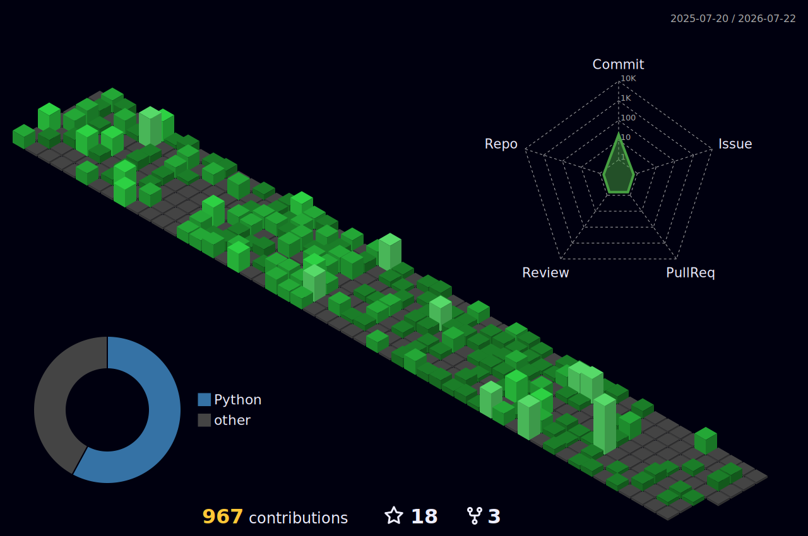

<!---
########################################
#                                      #
#             festusmaithyakcau        #
#                                      #
#            Copyright 2026            #
#         All Rights Reserved          #
########################################
--->


<div align="center">

🔴 🟡 🟢 &nbsp;&nbsp; **festus@maithya-os** — zsh — 100×24

</div>

```bash
festus@maithya-os ~ % whoami
Festus Maithya

festus@maithya-os ~ % neofetch --minimal
OS: FestusOS 2026.07.09
Status: online · clearance: alpha
```

<div align="center">

[](https://git.io/typing-svg)

</div>

<div align="center">


</div>

> | **LOCALE** | 🇺🇸 EN-US | [🌍 NRB-KE](https://github.com/festusmaithyakcau/festusmaithyakcau/blob/main/README.en-us.md) |
> | --- | --- | --- |

---

## ⚡ `[MODULE 01]` — TECH\_STACK.DATABASE

<details open>
<summary><b>► EXPAND :: QUERY TECHNOLOGY DATABASE</b></summary>

<div align="center">

🔴 🟡 🟢 &nbsp;&nbsp; **festus@maithya-os** — zsh — 100×24

</div>

```bash
festus@maithya-os ~ % stack --query certified --format=badge
```

**`CLUSTER_01`** &nbsp;::&nbsp; PROGRAMMING\_LANGUAGES

<div align="center">


</div>

**`CLUSTER_02`** &nbsp;::&nbsp; DATA\_ENGINEERING

<div align="center">


</div>

**`CLUSTER_03`** &nbsp;::&nbsp; CLOUD\_COMPUTING & AI

<div align="center">


</div>

</details>

---

## 🌐 `[MODULE 02]` — CONTRIBUTION\_MATRIX.3D\_RENDER

<details open>
<summary><b>► EXPAND :: HOLOGRAPHIC PROJECTION UNIT</b></summary>

<div align="center">

🔴 🟡 🟢 &nbsp;&nbsp; **festus@maithya-os** — zsh — 100×24

</div>

```bash
festus@maithya-os ~ % render --mode=3d --source=contributions --live
```

<div align="center">



</div>

</details>

---

## 📊 `[MODULE 03]` — SYSTEM\_ANALYTICS.GITHUB\_STATS

<details open>
<summary><b>► EXPAND :: CONNECT TO GITHUB TELEMETRY SERVER</b></summary>

<div align="center">

🔴 🟡 🟢 &nbsp;&nbsp; **festus@maithya-os** — zsh — 100×24

</div>

```bash
festus@maithya-os ~ % stats fetch --user festusmaithyakcau --live
```

<div align="center">


</div>

</details>

---

## 🧬 `[MODULE 04]` — LANGUAGE\_MATRIX.ANALYSIS

<details open>
<summary><b>► EXPAND :: SCAN REPOSITORY NEURAL NETWORK</b></summary>

<div align="center">

🔴 🟡 🟢 &nbsp;&nbsp; **festus@maithya-os** — zsh — 100×24

</div>

```bash
festus@maithya-os ~ % lang --analyze --commits --repos
```

<div align="center">

| `COMMIT FREQUENCY` | `REPOSITORY DISTRIBUTION` |
| :---: | :---: |
|  |  |

</div>

```bash
festus@maithya-os ~ % cat analysis.log
Predominant languages reflect primary commit + repository activity.
Cross-platform adaptive deployment across any technology stack.
Status: MULTI-LANG CERTIFIED · CROSS-PLATFORM ENABLED
```

</details>

---

## ⚡ `[MODULE 05]` — CONTRIBUTION\_STATUS.TRACKER

<details open>
<summary><b>► EXPAND :: REAL-TIME CONTRIBUTION TELEMETRY</b></summary>

<div align="center">

🔴 🟡 🟢 &nbsp;&nbsp; **festus@maithya-os** — zsh — 100×24

</div>

```bash
festus@maithya-os ~ % streak --status --live
```

<div align="center">

| `STREAK STATUS` | `PRODUCTIVITY INDEX` |
| :---: | :---: |
|  |  |

</div>

</details>

---

## 🏆 `[MODULE 06]` — ACHIEVEMENT\_ARRAY.UNLOCKED

<details open>
<summary><b>► EXPAND :: LOAD ACHIEVEMENT DATABASE</b></summary>

<div align="center">

🔴 🟡 🟢 &nbsp;&nbsp; **festus@maithya-os** — zsh — 100×24

</div>

```bash
festus@maithya-os ~ % trophy --list --unlocked
```

<div align="center">


</div>

</details>

---

## 👁️ `[MODULE 07]` — SURVEILLANCE.PROFILE\_COUNTER

<div align="center">

🔴 🟡 🟢 &nbsp;&nbsp; **festus@maithya-os** — zsh — 100×24

</div>

```bash
festus@maithya-os ~ % visitors --count --total
```

<div align="center">


</div>

---

## 📡 `[MODULE 08]` — COMM\_ARRAY.OPEN\_CHANNELS

<details open>
<summary><b>► EXPAND :: ESTABLISH SECURE TRANSMISSION LINK</b></summary>

<div align="center">

🔴 🟡 🟢 &nbsp;&nbsp; **festus@maithya-os** — zsh — 100×24

</div>

```bash
festus@maithya-os ~ % contact --channels --list
```

<div align="center">

[](https://www.instagram.com/)
[](mailto:festusmaithya264@gmail.com)
[](https://www.linkedin.com/in/festus-maithya-728912243/)
[](https://www.youtube.com/channel/UCA5f3pvEy7vFEtHMQGaqHWg)

</div>

</details>

---

<div align="center">

🔴 🟡 🟢 &nbsp;&nbsp; **festus@maithya-os** — zsh — 100×24

</div>

```bash
festus@maithya-os ~ % exit
Saving session... done.
[Process completed] SEE YOU ON THE OTHER SIDE, OPERATOR.
```


