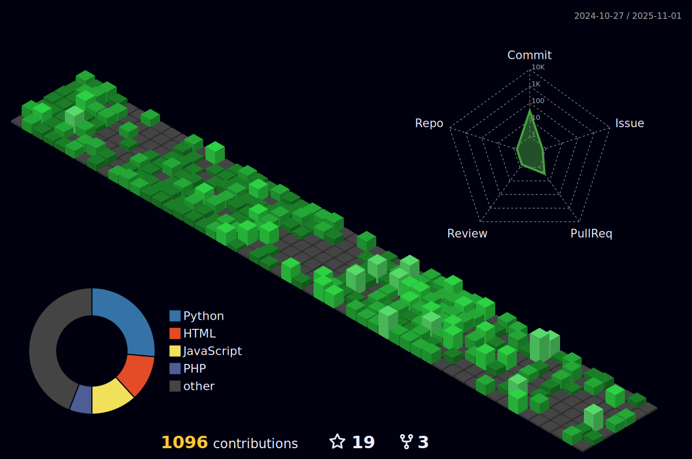

<!---
########################################
#                                      #
#             festusmaithyakcau        #
#                                      #
#            Copyright 2025            #
#         All Rights Reserved          #
########################################
--->

  

> **| Language | 🇺🇸 EN-US | [NRB-KE ](https://github.com/festusmaithyakcau/festusmaithyakcau/blob/main/README.en-us.md)** |
> | --- | --- | --- |

<h2>🖥️ Tech Stack</h2>

<strong>Programming Languages</strong> ‖ <strong>Data Engineering</strong> ‖ <strong>Cloud Computing & AI</strong>

  <!-- Programming Languages -->
  
    
    
    
    
    
    
  

  <!-- Data Engineering -->
  
    
    
    
    
    
    
    
  

  <!-- Cloud + AI -->
  
    
    
    
    
    
    
    
    
  

<h2 align=center>Contribution Graph</h2>

 

 
<h2 >Github Views :heart:  
</h2> 

  

<!--prs_merged_percentage,-->

## Predominant Languages

| Commits | Repositórios |
| --- | --- |
|  |  |

Note: My GitHub has these predominant languages but as a cross-platform dev,I can easily adapt to develop solid and scalable systems in any technology.

## Contribution Status

| Contributions | Average productivity |
| --- | --- |
|  |  |

## Trophies

<!---->

 
  
  
  
  
  

  

    

